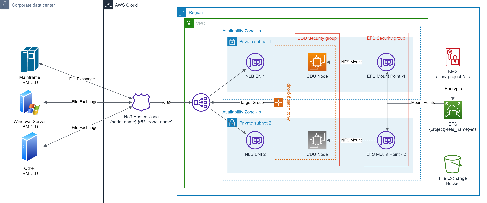
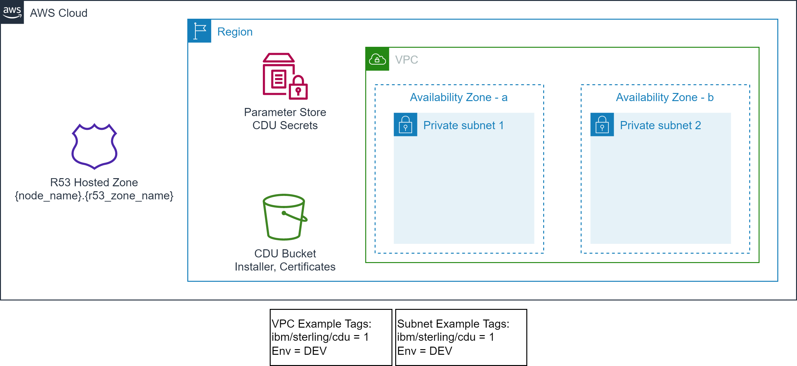
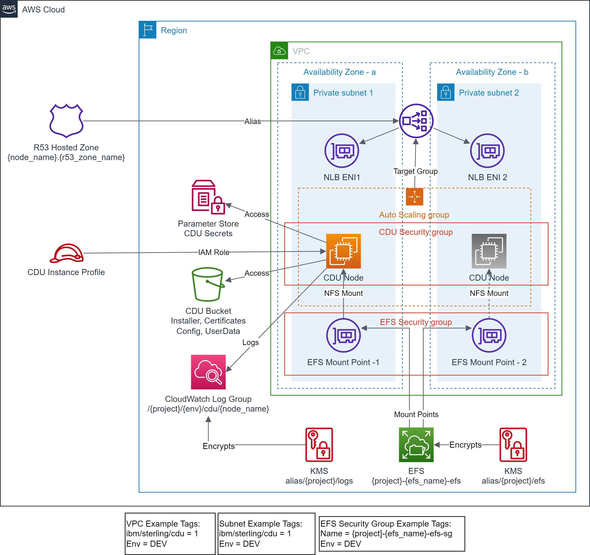

# Provision IBM® Sterling Connect:Direct® for UNIX on Amazon EC2 with high-availability and resiliency enabled via Amazon EFS

This is a Terraform module that provisions [IBM® Sterling Connect:Direct® (C:D)](https://www.ibm.com/products/connect-direct) for [UNIX](https://www.ibm.com/docs/en/connect-direct/6.2.0?topic=guide-connectdirect-unix-overview) on Amazon EC2 with [high-availability](https://www.ibm.com/docs/en/connect-direct/6.2.0?topic=unix-defining-high-availability-settings-in-configuration-files) and resiliency using Amazon EFS

## Introduction
IBM® Sterling Connect:Direct® provides secured and high-volume point-to-point file transfers within and among enterprises. In an enterprise scenario, the IBM C:D is installed on a multiple platforms including mainframe, UNIX, or Microsoft Windows server and is used to exchange files with other IBM C:D sites.

To support the AWS Cloud strategy for an enterprise, a solution is presented where a highly-available and resilient IBM C:D Unix instance on Amazon EC2 is deployed to exchange files with Amazon S3 and other on-premises IBM C:D sites including z/OS® and OS/400®.
<p align="center"></p>

- High-availability is implemented via auto scaling group to maintain minimum 1 IBM C:D Unix instance in the configured availability zones.
- IBM C:D Unix instance is fronted by Network Load-Balancer (NLB) to route the traffic to the available instance.
- On-premises IBM C:D sites communicate via the domain name defined at the Route 53 that is resolved to the NLB.
- Resiliency of the server state is implemented via highly-available and encrypted Amazon EFS instance with mount points in each availability zone.
- Security Groups are used for access control to the C:D server and EFS mount points.

## Features

The terraform module has following features:

- Provision a [IBM C:D Unix](https://www.ibm.com/docs/en/connect-direct/6.2.0?topic=deployment-connectdirect-unix-silent-installation) node with high-availability and resiliency using [Amazon EFS](https://aws.amazon.com/efs/) in the existing VPC and subnets identified via tags.
  - Amazon EC2 [Auto Scaling Group](https://docs.aws.amazon.com/autoscaling/ec2/userguide/auto-scaling-groups.html) is created (`min=1,max=1,desired=1`) to maintain minimum 1 IBM C:D Unix instance.
  - Optionally, provision the IBM C:D Unix node using [Amazon EBS](https://aws.amazon.com/ebs/) without resiliency of state.
- Use a shared Amazon EFS instance (identified by `efs_id`), or provision a new [regional](https://docs.aws.amazon.com/efs/latest/ug/storage-classes.html) Amazon EFS instance with [lifecycle management](https://docs.aws.amazon.com/efs/latest/ug/lifecycle-management-efs.html), [EFS mount target(s)](https://docs.aws.amazon.com/efs/latest/ug/manage-fs-access.html), and [security group](https://docs.aws.amazon.com/efs/latest/ug/network-access.html) in the existing VPC and subnets identified via tags.
  - Optionally encrypt the created EFS file system using an existing [AWS KMS](https://aws.amazon.com/kms/) key or provision a new AWS KMS key for EFS encryption.
  - Adds necessary rules to the EFS security group, so that IBM C:D Unix instance can access it.
- Use an existing [instance profile](https://docs.aws.amazon.com/IAM/latest/UserGuide/id_roles_use_switch-role-ec2_instance-profiles.html) or provision a new instance profile with necessary access to Amazon S3 and Amazon CloudWatch.
- Install and configure the CloudWatch agent to forward the server logs to the Amazon CloudWatch logs.
- Optionally encrypt the attached Amazon EBS, [Amazon CloudWatch Logs](https://docs.aws.amazon.com/AmazonCloudWatch/latest/logs/WhatIsCloudWatchLogs.html), and [AWS System Manager Parameter Store](https://docs.aws.amazon.com/systems-manager/latest/userguide/systems-manager-parameter-store.html) using an existing AWS KMS key or provision a new AWS KMS key for the respective service.
- Optionally create a [Network Load Balancer](https://aws.amazon.com/elasticloadbalancing/network-load-balancer/) to front the network traffic and to provide consistent IP address to the client(s).
- Optionally creates a DNS record for the Network Load Balancer via providing the [Route 53 private hosted zone](https://docs.aws.amazon.com/Route53/latest/DeveloperGuide/hosted-zones-private.html) name.
- Support well-known tag based backup using AWS Backup.
- Customize the IBM C:D Unix node by providing your own
  - node name (`node_name`)
  - server `keycert` file.
  - `netmap.cfg` file (optional).
  - `userfile.cfg` file (optional).
  - installation folder structure (optional).
  - POSIX UID/GID for the `cdadmin` user (optional)
  - extra test or process files to be copied to the server.
  - Source CIDRs to allow access to the server.
  - [Amazon machine image (AMI)](https://docs.aws.amazon.com/AWSEC2/latest/UserGuide/AMIs.html) (optional)
  - [Amazon EC2 instance type](https://aws.amazon.com/ec2/instance-types/) (optional)
- Uniformly name and tag the provisioned resources.
- Additional module ([tls\pca](./modules/tls/pca)) is provided for generating IBM C:D Unix compatible server `keycert` file for development and testing purpose.

## Prerequisites

- The target AWS Account and AWS Region are identified.
- The AWS User/Role executing the Terraform scripts must have permissions to provision the target resources in the owner account.
- The [Terraform CLI](https://learn.hashicorp.com/tutorials/terraform/install-cli?in=terraform/aws-get-started) (`version = ">= 1.1.9"`) is installed.
- The [AWS CLI v2](https://awscli.amazonaws.com/v2/documentation/api/latest/reference/index.html) is installed.
- The [Python 3.9+](https://www.python.org/downloads/) is installed.
- AWS SDK for Python [boto3 1.24+](https://boto3.amazonaws.com/v1/documentation/api/latest/guide/quickstart.html#installation) is installed.
- The [openssl 1.1.1+](https://www.openssl.org/) is installed, if you are generating your own server certificate.
- Terraform backend provider and state locking providers are identified and bootstrapped.
  - A [bootstrap](./examples/bootstrap) module/example is provided that provisions an Amazon S3 bucket for Terraform state storage and Amazon DynamoDB table for Terraform state locking.
    - **The Amazon S3 bucket name must be globally unique.**
- The target VPC along with the target Subnets exist and are identified via tags.
  - A [vpc](./examples/vpc) example is provided that provisions VPC, Subnets and related resources with example tagging.
- Optionally, Route 53 Hosted zone exists and identified by name.
  - The [vpc](./examples/vpc) example also creates a private hosted zone.
- A unique project code name e.g., `cdu-x` is identified that will be used to uniformly name the key aliases.
- Uniform resource tagging scheme is identified.
  - *The examples use only two tags: `Env` and `Project`*
- An Amazon S3 bucket (`s3_bucket`), used for the IBM C:D Unix installer binary and configuration files exists and identified by name.
  - *The examples are using the same Amazon S3 bucket that is used for Terraform state.*
- IBM C:D Unix installation binary from the IBM distribution (e.g. IBM_CD_V6.2_UNIX_RedHat.Z.tar.Z) is obtained and uploaded to the `s3_bucket`.
    - Upload the installation binary to the `s3_bucket` at the prefix `/cdu`.
- IBM C:D Unix server `keycert` file is generated and uploaded to the `s3_bucket`.
  - Obtain the TLS server certificate from your enterprise certificate authority (CA) or create a private certificate authority (PCA) and server certificate.
    - *The server `keycert` file is created by concatenating the encrypted private key and the server certificate issued by the CA into a single keycert file.*
  - *A [tls](./examples/tls) example is provided that creates a PCA and server `keycert` files that are automatically uploaded to the `s3_bucket`. This can be used for testing purpose only.*
  - If you are generating the server `keycert` file from key/certificate obtained from the enterprise CA.
    - Upload it to the `s3_bucket` along with the CA Certificate and the Issuer Certificate at the prefix `/cdu/node-name`.
- The server private key encryption password is stored in the AWS System Manager Parameter Store.
  - The server `keycert` file has encrypted private key which is protected by a password. This password must be stored in the AWS System Manager Parameter Store with a fixed key "`secret_key_prefix`/cert_password"
- The server [Java KeyStore](https://en.wikipedia.org/wiki/Java_KeyStore) password is stored in the AWS System Manager Parameter Store.
  - The IBM C:D Unix installation process creates a Java KeyStore, which is protected by a password. This password must be stored in the AWS System Manager Parameter Store with a fixed key "`secret_key_prefix`/keystore_password"

## Usage

- Use the module via [GitHub source](https://www.terraform.io/language/modules/sources#github) or copy the module into your repository.
- Incorporate the module in your infrastructure/storage [CI](https://aws.amazon.com/devops/continuous-integration/)/[CD](https://aws.amazon.com/devops/continuous-delivery/) [pipeline](https://docs.aws.amazon.com/codepipeline/latest/userguide/concepts.html) as appropriate.
- This solution uses [external module aws-tf-kms](https://github.com/aws-samples/aws-tf-kms) to provision AWS KMS Key(s), if encryption is enabled and `cdu_encryption.*_kms_alias` is not provided.
- This solution uses [external module aws-tf-efs](https://github.com/aws-samples/aws-tf-efs) to provision Amazon EFS, if `cdu_efs_specs.efs_id` is not provided.
- The following code block is a simple example of using this module with default values.
  ```terraform
  module "cdu" {
    source = "./modules/aws/cdu"

    region = "us-east-1"

    project  = "cdu-x"
    env_name = "dev"

    tags = {
      Env     = "DEV"
      Project = "cdu-x"
    }

    vpc_tags = {
      "ibm/sterling/cdu" = "1"
      "Env"              = "DEV"
    }

    subnet_tags = {
      "ibm/sterling/cdu" = "1"
      "Env"              = "DEV"
    }

    r53_zone_name = "cdu.samples.aws"

    kms_admin_roles = ["Admin"]

    cdu_params = {
      node_name      = "USLDCDUEX1"
      s3_bucket      = "cdu-x-bucket"
      server_keycert = "usldcduex1.cdu-keycert.txt"
    }
  }
  ```


## Scenarios
This solution primarily supports the following scenarios though many other scenarios are possible.
### Scenario 1: Provision IBM® Sterling Connect:Direct® Unix solution - Owned Amazon EFS
In this scenario the lifecycle of IBM C:D Unix node and related resources such as Amazon EFS and mount target(s) are owned by the IBM C:D Unix team. This is applicable when an independent IBM C:D Unix instance is needed and storage is not shared with any other components.

**Prerequisites**
- The target VPC along with the target Subnets exist and identified via tags.
- Optionally, Route 53 Hosted zone exists and identified by name.
<p align="center"></p>

- EFS file system does not exist.
- EFS access point does not exist.
- EFS mount targets do not exist in the target VPC Subnets.
- EFS Security Group does not exist.
- An Amazon S3 bucket (`s3_bucket`), used for the IBM C:D Unix installer binary and configuration files exists and identified by name.
- IBM C:D Unix installation binary from the IBM distribution (e.g. IBM_CD_V6.2_UNIX_RedHat.Z.tar.Z) is obtained and uploaded to the `s3_bucket`.
- IBM C:D Unix server `keycert` file is obtained and uploaded to the `s3_bucket`.
- The server private key encryption password is stored in the AWS System Manager Parameter Store.
- The server [Java KeyStore](https://en.wikipedia.org/wiki/Java_KeyStore) password is stored in the AWS System Manager Parameter Store.

**Outcome**
<p align="center"></p>

- EFS file system is created.
- EFS Security Group is created with default rules.
- EFS mount targets are created in the target VPC Subnets.
- Standardized EFS resource policy is created.
- No EFS access points are created.
- Encrypted CloudWatch log group is created for CDU node logs.
- IAM role and instance profile for CDU instance is created.
- Security Group for network access control to CDU instance is created.
- CDU instance is provisioned with state managed on EFS.
- Test files and scripts are copied to the CDU instance.
- Auto scaling group is created to manage minimum availability of CDU instance.
- NLB instances is provisioned fronting the CDU instance.
- Route 53 alias record is created pointing to NLB.

### Scenario 2: Provision IBM® Sterling Connect:Direct® Unix solution - Shared Amazon EFS
In this scenario the lifecycle of a shared Amazon EFS and mount target(s) is owned by a centralized team, while the lifecycle of IBM C:D Unix node and related resources is owned by the IBM C:D Unix team. This is applicable when an IBM C:D Unix instance may share the storage with other components. For example:
- AWS Transfer family SFTP server is created that may use this shared EFS as storage backend.
- Amazon EC2 instances may mount this EFS to exchange files with SFTP server or IBM C:D Unix node.

**Prerequisites**
- The target VPC along with the target Subnets exist and identified via tags.
- Optionally, Route 53 Hosted zone exists and identified by name.
<p align="center"></p>

- EFS file system exist.
- EFS mount targets exist in the target VPC Subnets.
- EFS Security Group exist and identified via tags.
- An Amazon S3 bucket (`s3_bucket`), used for the IBM C:D Unix installer binary and configuration files exists and identified by name.
- IBM C:D Unix installation binary from the IBM distribution (e.g. IBM_CD_V6.2_UNIX_RedHat.Z.tar.Z) is obtained and uploaded to the `s3_bucket`.
- IBM C:D Unix server `keycert` file is obtained and uploaded to the `s3_bucket`.
- The server private key encryption password is stored in the AWS System Manager Parameter Store.
- The server [Java KeyStore](https://en.wikipedia.org/wiki/Java_KeyStore) password is stored in the AWS System Manager Parameter Store.

**Outcome**
<p align="center"></p>

- Encrypted CloudWatch log group is created for CDU node logs.
- IAM role and instance profile for CDU instance is created.
- Security Group for network access control to CDU instance is created.
- CDU instance is provisioned with state managed on EFS.
- Test files and scripts are copied to the CDU instance.
- Auto scaling group is created to manage minimum availability of CDU instance.
- NLB instances is provisioned fronting the CDU instance.
- Route 53 alias record is created pointing to NLB.

## Future Enhancements
- Support for IBM Sterling Connect:Direct Web Services can be added.

## Security

See [CONTRIBUTING](CONTRIBUTING.md#security-issue-notifications) for more information.

## License

This library is licensed under the MIT-0 License. See the [LICENSE](LICENSE) file.
