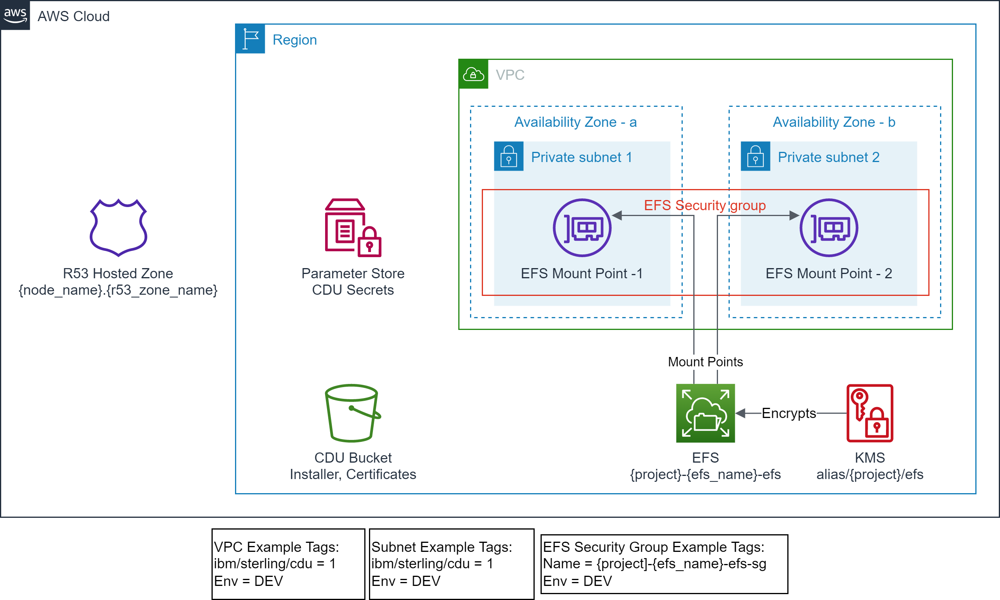
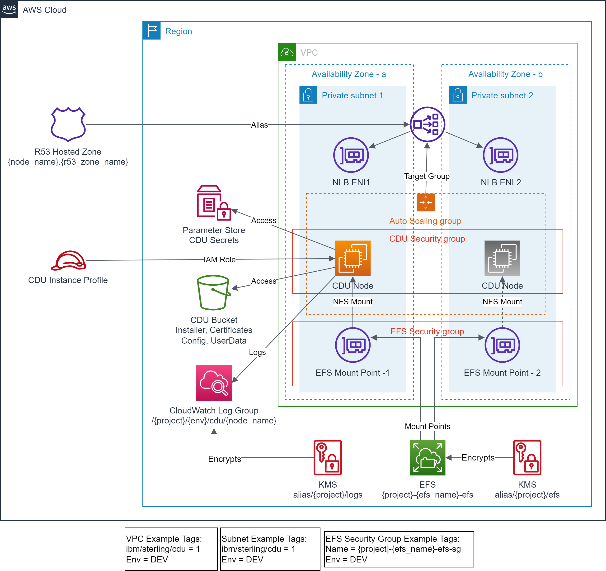

# Scenario 2: Provision IBM® Sterling Connect:Direct® Unix solution - Shared Amazon EFS
In this scenario the lifecycle of a shared Amazon EFS and mount target(s) is owned by a centralized team, while the lifecycle of IBM C:D Unix node and related resources is owned by the IBM C:D Unix team. If this solution is destroyed the Amazon EFS is not impacted.

## Prerequisites
- Terraform backend provider and state locking providers are identified and bootstrapped.
    - A [bootstrap](../../bootstrap) module/example is provided that provisions Amazon S3 for Terraform state storage and Amazon DynamoDB for Terraform state locking.
- The target VPC along with the target Subnets exist and identified via tags.
    - A [vpc](../../vpc) example is provided that provisions VPC, Subnets and related resources with example tagging.
        - The example uses the following tags to identify the target VPC and Subnets.
            ```text
            "ibm/sterling/cdu" = "1"
            "Env"              = "DEV"
            ```
- Optionally, Route 53 Hosted zone exists and identified by name.
    - the [vpc](../../vpc) example creates a private hosted zone. e.g. "cdu.samples.aws"
<p align="center"></p>

- EFS file system exist and identified via `efs_id`.
    - Execute steps in [examples/efs](../../efs) to set this up.
- EFS mount targets exist in the target VPC Subnets.
- EFS Security Group exist and identified via tags.
- An Amazon S3 bucket (`s3_bucket`), used for the IBM C:D Unix installer binary and configuration files exists and identified by name.
    - *The examples are using the same Amazon S3 bucket that is used for Terraform state. e.g. aws-tf-cdu-dev-terraform-state-bucket*
- IBM C:D Unix installation binary from the IBM distribution (e.g. IBM_CD_V6.2_UNIX_RedHat.Z.tar.Z) is obtained and uploaded to the `s3_bucket` at the prefix `/cdu`.
    - Upload the installation binary to the `s3_bucket` at the prefix `/cdu`. For Example:
        ```bash
        aws s3 cp IBM_CD_V6.2_UNIX_RedHat.Z.tar.Z s3://aws-tf-cdu-dev-terraform-state-bucket/cdu/IBM_CD_V6.2_UNIX_RedHat.Z.tar.Z
        ```
- IBM C:D Unix server `keycert` file is obtained and uploaded to the `s3_bucket`.
    - Obtain the TLS server certificate from your enterprise certificate authority (CA) or create a private certificate authority (PCA) and server certificate.
        - *The server `keycert` file is created by concatenating the encrypted private key and the server certificate issued by the CA into a single keycert file.*
    - *A [tls](../../tls) example is provided that creates a PCA and server `keycert` files that are automatically uploaded to the `s3_bucket`. This can be used for testing purpose only.*
    - If you are generating the server `keycert` file from key/certificate obtained from the enterprise CA.
        - Upload it to the `s3_bucket` along with the CA Certificate and the Issuer Certificate at the prefix `/cdu/node-name`. For example:
            ```bash
            aws s3 cp usldcduc02.cdu-keycert.txt s3://aws-tf-cdu-dev-terraform-state-bucket/cdu/USLDCDUC02/usldcduc02.cdu-keycert.txt
            aws s3 cp ca-cert.cer s3://aws-tf-cdu-dev-terraform-state-bucket/cdu/USLDCDUC02/ca-cert.cer
            aws s3 cp issuer-cert.cer s3://aws-tf-cdu-dev-terraform-state-bucket/cdu/USLDCDUC02/issuer-cert.cer
            ```
- The server private key encryption password is stored in the AWS System Manager Parameter Store.
    - The server `keycert` file has encrypted private key which is protected by a password. This password must be stored in the AWS System Manager Parameter Store with a fixed key "`secret_key_prefix`/cert_password"
    - The recommended `secret_key_prefix` is "/`project`/`env_name`/cdu/`node_name`"
    - It is encouraged to create the secret key via AWS CLI rather than Terraform. For example:
        ```bash
        aws ssm put-parameter --name /scenario2-cdu/dev/cdu/USLDCDUC02/cert_password --value changeme --type SecureString --overwrite
        ```
- The server [Java KeyStore](https://en.wikipedia.org/wiki/Java_KeyStore) password is stored in the AWS System Manager Parameter Store.
    - The IBM C:D Unix installation process creates a Java KeyStore, which is protected by a password. This password must be stored in the AWS System Manager Parameter Store with a fixed key "`secret_key_prefix`/keystore_password"
    - The recommended `secret_key_prefix` is "/`project`/`env_name`/cdu/`node_name`"
    - It is encouraged to create the secret key via AWS CLI rather than Terraform. For example:
        ```bash
        aws ssm put-parameter --name /scenario2-cdu/dev/cdu/USLDCDUC02/keystore_password --value changeme --type SecureString --overwrite
        ```

## Outcome

<p align="center"></p>

- Encrypted CloudWatch log group is created for CDU node logs.
- IAM role and instance profile for CDU instance is created.
- Security Group for network access control to CDU instance is created.
- CDU instance is provisioned with state managed on EFS.
- Test files and scripts are copied to the CDU instance.
- Auto scaling group is created to manage minimum availability of CDU instance.
- NLB instances is provisioned fronting the CDU instance.
- Route 53 alias record is created pointing to NLB.

## Execution

- cd to `examples/cdu/scenario2` folder.
- Modify the `backend "S3"` section in `provider.tf` with correct values for `region`, `bucket`, `dynamodb_table`, and `key`.
    - Use provided values as guidance.
- Modify `terraform.tfvars` to your requirements.
    - Use provided values as guidance.
    - **e.g. use efs_id and security_group_tags from [examples/efs](../../efs) output**
- Modify `main.tf` to your requirements.
    - Use provided values as guidance.
- Examine the files in the `examples/cdu/scenario1/<node-name>` folder.
    - Use the provided samples as guidance.
- Make sure you are using the correct AWS Profile that has permission to provision the target resources.
    - `aws sts get-caller-identity`
- Execute `terraform init` to initialize Terraform.
- Execute `terraform plan` and verify the changes.
- Execute `terraform apply` and approve the changes to provision the resources.

## Test IBM C:D Unix Node
The example provides some test files that can be used to test the IBM C:D Unix node.
1. test.txt -> A test file that will be copied.
2. test-l.cd -> C:D process file that copies test file from `PNODE` to `PNODE`.
3. test-l-s3.cd -> C:D process file that copies test file from `PNODE` to Amazon S3.
4. test-s3-l.cd -> C:D process file that copies test file from Amazon S3 to `PNODE`.
5. test-l-r.cd -> C:D process file that copies test file from `PNODE` to `SNODE`.
6. test-r-l.cd -> C:D process file that copies test file from `SNODE` to `PNODE`.

Following are the generic testing steps.
```bash
# Connect to the EC2 instance via SSM
aws ssm start-session --target <instance-id>

# Switch to cdadmin user
sudo su - cdadmin

# cd to ndm/bin folder, all test files are copied here
[cdadmin@ip-xx-x-xxx-xxx ~]$ cd cdunix/ndm/bin

# start the C:D client shell
[cdadmin@ip-xx-x-xxx-xxx bin]$ ./direct
        **************************************************************
        *                                                            *
        *            Licensed Materials - Property of IBM            *
        *                                                            *
        *         IBM(R) Connect:Direct(R) for UNIX 6.2.0.0          *
        *                   Build date: 27Aug2021                    *
        *                                                            *
        *  (C) Copyright IBM Corp. 1992, 2021 All Rights Reserved.   *
        *                                                            *
        **************************************************************

Enter a ';' at the end of a command to submit it. Type 'quit;' to exit CLI.

Direct>

# submit the test process and note down the process number
Direct> submit file test-l.cd ;
Process Submitted, Process Number = 6

# check the statistics for the process
Direct> select stat pnum 6 ;
===============================================================================
                           SELECT  STATISTICS
===============================================================================
P RECID LOG TIME            PNAME        PNUMBER  STEPNAME   CCOD FDBK MSGID
E RECID LOG TIME            MESSAGE TEXT
X RECID LOG TIME            APP DESC     USID     NODENAME   CCOD MSGID
-------------------------------------------------------------------------------
E QCEX  08/05/2022 19:07:30 TCQ queue change from WAIT to EXEC, status PE.
E SSTR  08/05/2022 19:07:31 Session started, SNODE:USLDCDUC01, Protocol:tcp
                            LCLP        127.0.0.1, PORT=52588
                            RMTP        127.0.0.1, PORT=1364
P PSTR  08/05/2022 19:07:32 test-l             6                0      XSMG200I
...
...
E SEND  08/05/2022 19:07:37 Session ended, Session Manager shutting down SNODE:
                            USLDCDUC01
===============================================================================
Select Statistics Completed Successfully.

# Exit the C:D cli shell
Direct> quit ;

Connect:Direct CLI Terminated...

[cdadmin@ip-xx-x-xxx-xxx bin]$ exit
logout
sh-4.2$ exit
exit
```

<!-- BEGIN_TF_DOCS -->
## Requirements

| Name | Version |
|------|---------|
| <a name="requirement_terraform"></a> [terraform](#requirement\_terraform) | >= v1.3.9 |
| <a name="requirement_aws"></a> [aws](#requirement\_aws) | >= 4.56.0 |

## Providers

No providers.

## Modules

| Name | Source | Version |
|------|--------|---------|
| <a name="module_cdu_ha"></a> [cdu\_ha](#module\_cdu\_ha) | ../../../modules/aws/cdu | n/a |

## Resources

No resources.

## Inputs

| Name | Description | Type | Default | Required |
|------|-------------|------|---------|:--------:|
| <a name="input_env_name"></a> [env\_name](#input\_env\_name) | Environment name e.g. dev, prod | `string` | n/a | yes |
| <a name="input_node_name"></a> [node\_name](#input\_node\_name) | Unique Node Name | `string` | n/a | yes |
| <a name="input_project"></a> [project](#input\_project) | Project to be used on all the resources identification | `string` | n/a | yes |
| <a name="input_region"></a> [region](#input\_region) | The AWS Region e.g. us-east-1 for the environment | `string` | n/a | yes |
| <a name="input_s3_bucket"></a> [s3\_bucket](#input\_s3\_bucket) | Amazon S3 bucket name where cdu host related files are uploaded | `string` | n/a | yes |
| <a name="input_subnet_tags"></a> [subnet\_tags](#input\_subnet\_tags) | Tags used for filtering datasource aws\_subnets for VPC | `map(string)` | n/a | yes |
| <a name="input_tags"></a> [tags](#input\_tags) | Mandatory tags for the resources | `map(string)` | n/a | yes |
| <a name="input_vpc_tags"></a> [vpc\_tags](#input\_vpc\_tags) | Tags used for filtering datasource aws\_vpc for VPC | `map(string)` | n/a | yes |
| <a name="input_efs_id"></a> [efs\_id](#input\_efs\_id) | EFS File System Id | `string` | `null` | no |
| <a name="input_security_group_tags"></a> [security\_group\_tags](#input\_security\_group\_tags) | EFS Security Group Tags | `map(string)` | `null` | no |

## Outputs

| Name | Description |
|------|-------------|
| <a name="output_cdu_ami"></a> [cdu\_ami](#output\_cdu\_ami) | AMI for the CDU instance |
| <a name="output_cdu_cw_log_group"></a> [cdu\_cw\_log\_group](#output\_cdu\_cw\_log\_group) | CloudWatch log group for C:D Unix |
| <a name="output_cdu_efs_root"></a> [cdu\_efs\_root](#output\_cdu\_efs\_root) | CDU root folder on EFS |
| <a name="output_cdu_instance_profile"></a> [cdu\_instance\_profile](#output\_cdu\_instance\_profile) | Instance Profile for the CDU instance |
| <a name="output_cdu_kms"></a> [cdu\_kms](#output\_cdu\_kms) | KMS Keys created |
| <a name="output_cdu_nlb_dns"></a> [cdu\_nlb\_dns](#output\_cdu\_nlb\_dns) | NLB DNS for C:D Unix |
| <a name="output_cdu_r53_fqdn"></a> [cdu\_r53\_fqdn](#output\_cdu\_r53\_fqdn) | Route 53 FQDN for C:D Unix |
| <a name="output_cdu_security_group"></a> [cdu\_security\_group](#output\_cdu\_security\_group) | Security Group for the CDU |
| <a name="output_efs_id"></a> [efs\_id](#output\_efs\_id) | Elastic File System info |
<!-- END_TF_DOCS -->
