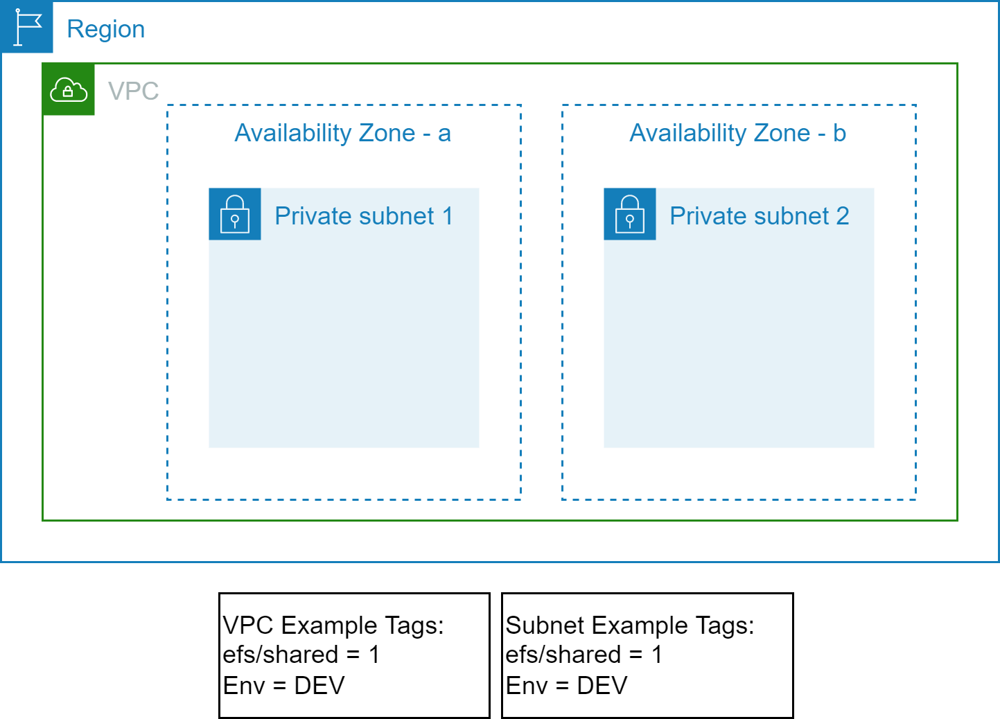
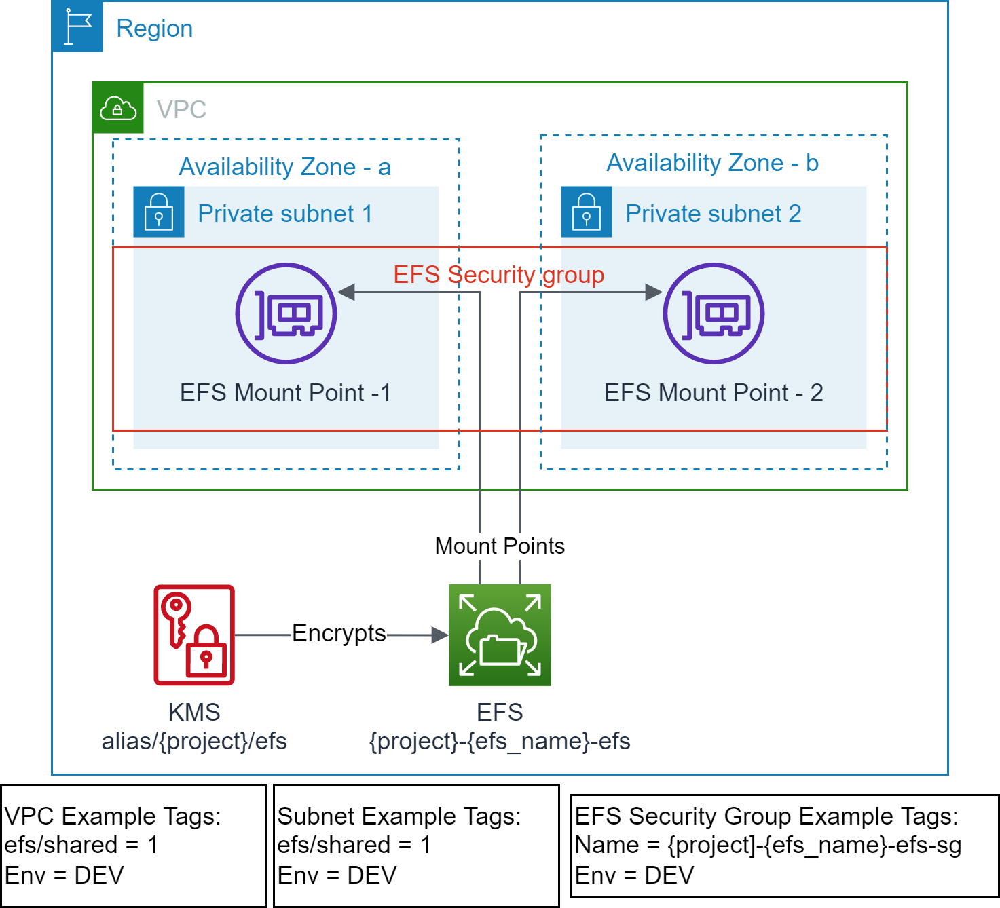

# Scenario: Create Shared Amazon EFS with Mount Target(s)
In this scenario the lifecycle of a shared Amazon EFS and mount target(s) is owned by a centralized team. It creates a shared Amazon EFS, on which one or more application teams can create their own EFS access point(s). For example:
- IBM C:D Unix node is created that may use this shared EFS for resiliency.
- AWS Transfer family SFTP server is created that may use this shared EFS as storage backend.
- Amazon EC2 instances may mount this EFS to exchange files with SFTP server or IBM C:D Unix node.

## Prerequisites

- Terraform backend provider and state locking providers are identified and bootstrapped.
  - A [bootstrap](../bootstrap) module/example is provided that provisions Amazon S3 for Terraform state storage and Amazon DynamoDB for Terraform state locking.
- The target VPC along with the target Subnets exist and identified via Tags.
  - A [vpc](../vpc) example is provided that provisions VPC, Subnets and related resources with example tagging.
  - The example uses the following tags to identify the target VPC and Subnets.
    ```text
    "efs/shared" = "1"
    "Env"        = "DEV"
    ```
<p align="center"></p>

- EFS file system does not exist.
- EFS access point does not exist.
- EFS mount targets do not exist in the target VPC Subnets.
- EFS Security Group does not exist.

## Outcome

<p align="center"></p>

- EFS file system is created.
- EFS Security Group is created with default rules.
- EFS mount targets are created in the target VPC Subnets.
- Standardized EFS resource policy is created.
- No EFS access points are created.

This is required step for [cdu/scenario2](../../cdu/scenario2)

## Execution

- cd to `examples/efs` folder.
- Modify the `backend "S3"` section in `provider.tf` with correct values for `region`, `bucket`, `dynamodb_table`, and `key`.
  - Use provided values as guidance.
- Modify `terraform.tfvars` to your requirements.
  - Use provided values as guidance.
- Make sure you are using the correct AWS Profile that has permission to provision the target resources.
  - `aws sts get-caller-identity`
- Execute `terraform init` to initialize Terraform.
- Execute `terraform plan` and verify the changes.
- Execute `terraform apply` and approve the changes to provision the resources.

<!-- BEGIN_TF_DOCS -->
## Requirements

| Name | Version |
|------|---------|
| <a name="requirement_terraform"></a> [terraform](#requirement\_terraform) | >= v1.3.9 |
| <a name="requirement_aws"></a> [aws](#requirement\_aws) | >= 4.56.0 |

## Providers

No providers.

## Modules

| Name | Source | Version |
|------|--------|---------|
| <a name="module_common_efs"></a> [common\_efs](#module\_common\_efs) | github.com/aws-samples/aws-tf-efs//modules/aws/efs | v1.0.0 |

## Resources

No resources.

## Inputs

| Name | Description | Type | Default | Required |
|------|-------------|------|---------|:--------:|
| <a name="input_env_name"></a> [env\_name](#input\_env\_name) | Environment name e.g. dev, prod | `string` | n/a | yes |
| <a name="input_project"></a> [project](#input\_project) | Project to be used on all the resources identification | `string` | n/a | yes |
| <a name="input_region"></a> [region](#input\_region) | The AWS Region e.g. us-east-1 for the environment | `string` | n/a | yes |
| <a name="input_subnet_tags"></a> [subnet\_tags](#input\_subnet\_tags) | Tags used for filtering datasource aws\_subnets for VPC | `map(string)` | n/a | yes |
| <a name="input_tags"></a> [tags](#input\_tags) | Mandatory tags for the resources | `map(string)` | n/a | yes |
| <a name="input_vpc_tags"></a> [vpc\_tags](#input\_vpc\_tags) | Tags used for filtering datasource aws\_vpc for VPC | `map(string)` | n/a | yes |
| <a name="input_efs_access_point_specs"></a> [efs\_access\_point\_specs](#input\_efs\_access\_point\_specs) | List of EFS Access Point Specs to be created. It can be empty list. | <pre>list(object({<br>    efs_name        = string # unique name e.g. common<br>    efs_ap          = string # unique name e.g. common_sftp<br>    uid             = number<br>    gid             = number<br>    secondary_gids  = list(number)<br>    root_path       = string # e.g. /{env}/{project}/{purpose}/{name}<br>    owner_uid       = number # e.g. 0<br>    owner_gid       = number # e.g. 0<br>    root_permission = string # e.g. 0755<br>    principal_arns  = list(string)<br>  }))</pre> | `[]` | no |
| <a name="input_efs_id"></a> [efs\_id](#input\_efs\_id) | EFS File System Id | `string` | `null` | no |
| <a name="input_security_group_tags"></a> [security\_group\_tags](#input\_security\_group\_tags) | Tags used for finding EFS Security Group | `map(string)` | `null` | no |

## Outputs

| Name | Description |
|------|-------------|
| <a name="output_efs"></a> [efs](#output\_efs) | Elastic File System info |
| <a name="output_efs_ap"></a> [efs\_ap](#output\_efs\_ap) | Elastic File System Access Points |
<!-- END_TF_DOCS -->
